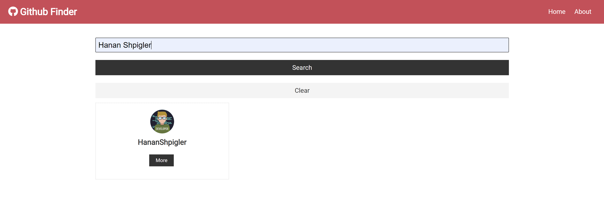
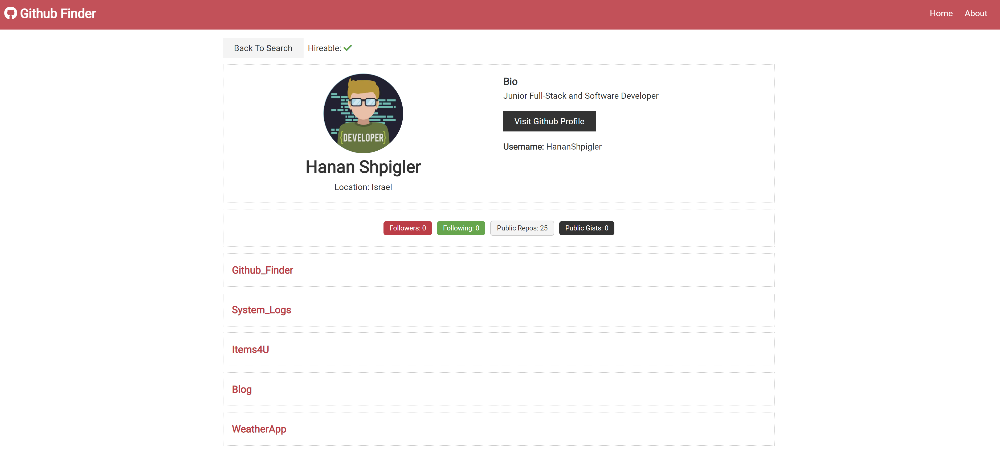

# GitHub Finder
A simple github finder

# Instructions
- Download the folder and install dependencies with `npm i`
- Open the terminal and type `npm start` to start the app.

 ###### 😉 Enjoy Searching Your GitHub Friends! 😉 ######
